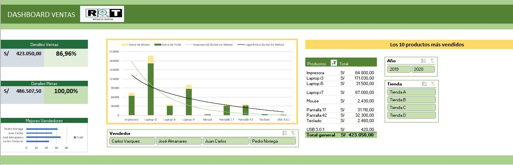

# Dashboard of Sales R&T DATA

How to create a dashboard sales with EXCEL.

# Targets
* Suma de todas las ventas y porcentaje 
* Suma de todas las metas y porcentaje (100%)
* Gráfico de Columnas con progreso (Metas Vs Ventas)
* Gráfico de barras mejores vendedores 
* Tabla dinámica de los 10 productos mas vendidos
* Gráfico de barras con superposición de serie 100%
* Segmentación por Años
* Segmentación por Tienda
* Segmentación por vendedores

## Screenshot

